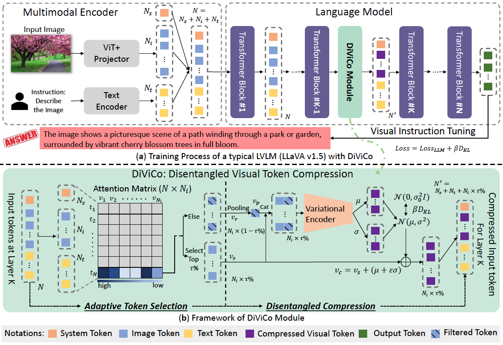

# DiViCo: Disentangled Visual Token Compression For Efficient Large Vision-Language Model
> [DiViCo: Disentangled Visual Token Compression For Efficient Large Vision-Language Model](https://mn.cs.tsinghua.edu.cn/xinwang/PDF/papers/2025_DiViCo%20Disentangled%20Visual%20Token%20Compression%20for%20Efficient%20Large%20Vision%20Language%20Model.pdf)
>
> Xin Wang, *Member*, *IEEE*, Zirui Pan, Hong Chen, Wenwu Zhu, *Fellow*, *IEEE*
> 
> Large Vision-Language Models have drawn much attention and become increasingly applicable in complicated multimodal tasks such as visual question answering, video grounding, etc. However, it still suffers from inefficiency problem during the inference stage due to the computational overhead brought by the large number of visual tokens. Existing works either utilize an attention score (or visual-text relevance) to filter out the less significant visual tokens, or insert learnable projection layers to directly compress the tokens, which neglects the informative details in visual signals and introduces information loss, resulting in poor generalizability to test data. To solve these problems, in this paper we propose a novel Disentangled Visual Token Compression module, i.e., DiViCo, that effectively compresses the visual tokens and maintains good performance simultaneously. In concrete, we first select the top $\tau\%$ visual tokens according to their average attention scores, then predict the gap between these selected tokens and the original information by employing the chosen tokens in a disentangled and variational manner. Specifically, we model the mean and variance, sampling the predicted gap from the Gaussian prior. We further keep the informativeness of the compressed visual tokens via KL divergence, which ensures the generalizability of the model. Extensive experiments demonstrate the advantage of our proposed DiViCo module against several state-of-the-art baselines over various real-world datasets. Most notably, LLaVA-v1.5-7b equipped with DiViCo is able to reduce 67.7\% FLOPs and save 51.7\% time while maintaining 95.6\% of the accuracy for LLaVA-v1.5-7b without any compression.

## Overview
This is the official implementation of TCSVT 2025 paper *DiViCo: Disentangled Visual Token Compression For Efficient Large Vision-Language Model*. The model weights can be downloaded from [Tsinghua Cloud](https://cloud.tsinghua.edu.cn/d/230279e749f0418d85af/).

## Framework


The overall framework of an LVLM with the proposed DiViCo module. Subfigure (a) shows the training process of a typical LVLM, i.e., LLaVA-v1.5. Typically, the images and texts are encoded separately before being concatenated and fed into the LLM, which usually adopts the decoder-only architecture. Our proposed DiViCo Module is inserted between the $(K-1)^{th}$ and $K^{th}$ layer of the decoder. Subfigure (b) demonstrates the detailed architecture of DiViCo. In concrete, we first perform adaptive token selection, where we retrieve the input visual tokens from layer $K$, and sample the top $\tau\%$ according to its average attention score. Next for the rest of the tokens, we employ a shallow neural network, i.e., variational encoder, to predict the information gap, i.e., performance differences between using only the selected tokens and using the whole original visual signals. Instead of directly predicting the information gap, we sample its value from a Gaussian distribution. In inference stage, the mean, i.e., $\mu$, is adopted as the predicted result. We further introduce a KL divergence loss to keep the compressed information disentangled in the latent space. Then we perform the reconstruction with the information gap being incorporated into the selected visual tokens, which completes the procedure. These compressed visual tokens are utilized as the input to the following decoder layers, thus greatly relieving the computational burden during the inference process.


## Setup

If you are not using Linux, do *NOT* proceed, see instructions for [macOS](https://github.com/haotian-liu/LLaVA/blob/main/docs/macOS.md) and [Windows](https://github.com/haotian-liu/LLaVA/blob/main/docs/Windows.md).

1. Install Package
```Shell
conda create -n disen_llava python=3.10 -y
conda activate disen_llava
pip install --upgrade pip  # enable PEP 660 support
pip install -e .
```

2. Install additional packages for training cases
```
pip install -e ".[train]"
pip install flash-attn --no-build-isolation
```

For evaluation setup, please follow the instruction in [repo](https://github.com/haotian-liu/LLaVA).

## Model-Zoo
Available Models are DiViCo for LLaVA-v1.5-7b and LLaVA-v1.5-13b under compression rate 88.9%. You can download the weights from [here](https://cloud.tsinghua.edu.cn/d/230279e749f0418d85af/).

For usage, you should input the `lora_path` in `disen_llava/model/builder.py` line 164 with the downloaded ckpt path. Then run the following command to evaluate LLaVA-v1.5-7b/13b on TextVQA (You may need to modify the llava ckpt path in `textvqa.sh`):
```bash
bash scripts/v1_5/eval/textvqa.sh
```

## Acknowledgement
Codebase built upon [LLaVA](https://github.com/haotian-liu/LLaVA).

## Citation
If you find our work useful, please kindly cite our work:
```bash
@article{wang2025divico,
  title={DiViCo: Disentangled Visual Token Compression for Efficient Large Vision-Language Model},
  author={Wang, Xin and Pan, Zirui and Chen, Hong and Zhu, Wenwu},
  journal={IEEE Transactions on Circuits and Systems for Video Technology},
  year={2025},
  publisher={IEEE}
}
```
